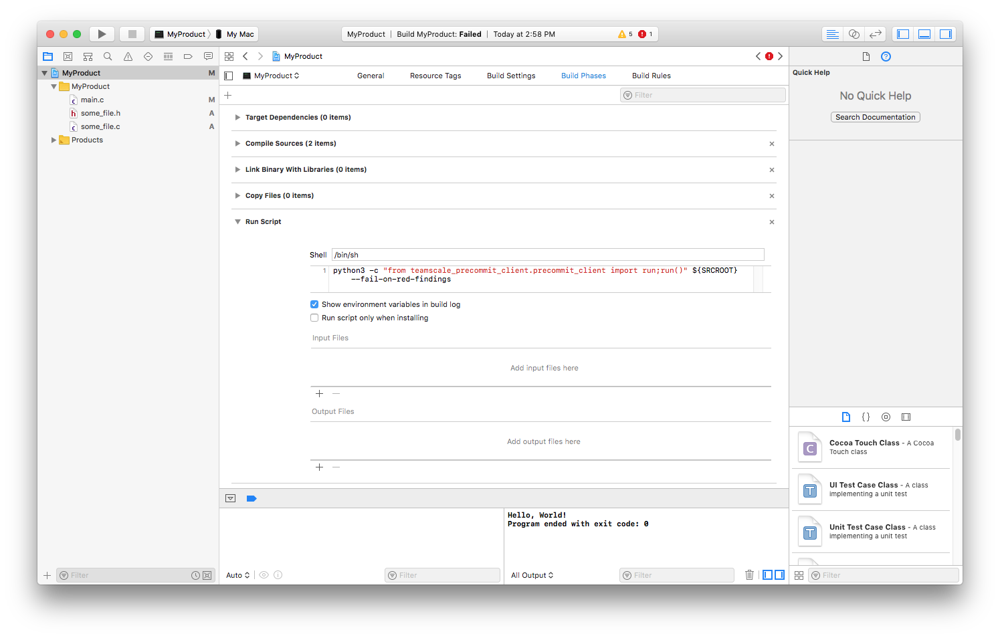
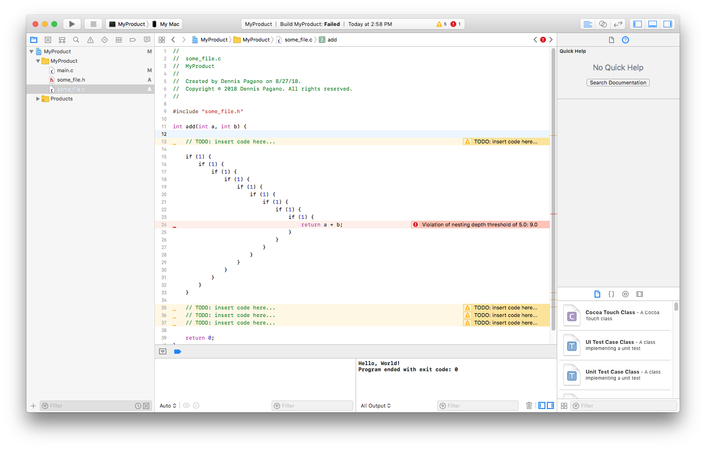

# Teamscale Precommit Command Line Client

The Teamscale precommit command line interface allows you to integrate precommit analysis in editors or IDEs such as VS Code, Emacs or Sublime, by providing findings in a standard error format that can be interpreted like compile time errors.


## Installation

1. Install ```libgit2```: https://libgit2.org (not necessary on Windows as it's already package with the pygit dependency)

2. Install this client via pip:
 ```bash
 $ pip install teamscale-cli
 ```

3. Copy the configuration file ```config/.teamscale-precommit.config``` to the root directory of the repository you want to analyze. Edit it and insert all the necessary data.

4. Use this script as compile or build command in your editor or IDE. See below for more information and a couple of examples on how to accomplish this. Provide a file or folder within your repository as input. The general invocation looks like this:

 ```bash
 $ python -c "from teamscale_precommit_client.precommit_client import run;run()" ANY_FILE_OR_FOLDER_IN_YOUR_REPO
 ```

5. The behavior of the client can be tweaked with several arguments. Run the client with the ```-h``` argument to get the usage.


## How to perform precommit analysis

When invoked, the precommit analysis client uploads the current changes from your Git repository to the Teamscale server and project you provided in the settings. The client then waits until Teamscale has analyzed these changes, and comes back with findings.
The findings will be printed to `stdout` in a pretty standard format similar to gcc findings:

`Path to file:line number:Column: (warning|error): Message`

This allows you to use the highlighting capabilities of your editors to mark the findings inline or to jump to the findings from the precommit output. For your convenience, we've provided sample configurations for some editors and IDEs.

### Sublime

Add a new *Build System* under `Tools > Build System`. Locate `config/teamscale-precommit.sublime-build` in this repo. Copy and paste the snippet and modify to your needs (e.g. `python` vs. `python3`).

### Xcode

Add a new *Build Phase* (`New Run Script Phase`) to your project. Enter the following command as shell script in that phase (see screenshot):

```bash
python -c "from teamscale_precommit_client.precommit_client import run;run()" ${SRCROOT} --fail-on-red-findings
```



As you're on a Mac, make sure to use the correct Python version in that snippet, which might be `python3`. The option `--fail-on-red-findings` will fail your Xcode build if new RED findings were found. You might decide to drop that flag. If you've done it right, Xcode will show all findings inlined as seen on the following screenshot:



### VS Code

Add a new task (`Terminal -> Configure Tasks`) and name it `Teamscale Precommit Analysis` or similar. VS Code will open a sample `tasks.json` for you to edit. Locate `config/teamscale-precommit-vscode-task.json` in this repo. Copy and paste the snippet and modify to your needs (e.g. `python` vs. `python3`).

### Vim

Locate `config/teamscale.vim` and put in into `~/.vim/compiler`. Modify to your needs (e.g. `python` vs. `python3`).
This should allow you to do `:compiler teamscale` and `:make %`. Then you should be able to use your usual workflow (e.g. `:cn`) to go through the findings.


## More details

### How does change detection work?

The client detects changes by querying your Git repository for its current status. The following change types will be considered:

- Modified files
- Renamed files
- Files added to the index
- Deleted files that were in the index

New files that are not in the index will be ignored.

### Which findings should be fetched?

By default, the precommit analysis client will fetch new findings in the changes you've made as well as findings that have existed in code you have modified. You can tweak this behavior using the following flags:

```
  --exclude-findings-in-changed-code
                        Determines whether to exclude findings in changed code
                        (default: False)
  --fetch-existing-findings
                        When this option is set, existing findings in the
                        specified file are fetched in addition to precommit
                        findings. (default: False)
  --fetch-all-findings
                        When this option is set, all existing findings in the
                        repo are fetched in addition to precommit findings.
                        (default: False)
```

Be cautious using these flags as there might be many findings in your code base.

### Other command line options

```
  --fail-on-red-findings
                        When this option is set, the precommit client will exit
                        with a non-zero return value whenever RED findings were
                        among the precommit findings. (default: False)
  --verify
                        Path to different certificate file.  See requests' verify
                        parameter in http://docs.python-requests.org/en/latest/user/advanced/#ssl-cert-verification
                        Other possible values: True, False (default: True)
```

## Limits

The precommit analysis has some builtin limits, whose goal is to prevent denial of service of the Teamscale server:

- Files uploaded for precommit analysis must be less than 1 MB in size.
- At most 20 files can be uploaded for precommit analysis (can be changed on the server).
- Precommit analysis uploads might only be done once every 5 seconds per user (can be changed on the server).
