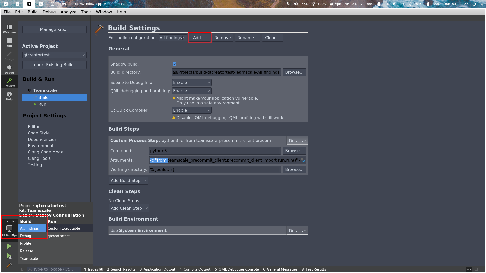

# Teamscale Pre-Commit Command Line Client [](https://travis-ci.org/cqse/teamscale-cli) [](https://badge.fury.io/py/teamscale-cli) [](https://demo.teamscale.com/activity.html#/teamscale-cli)

The [Teamscale](https://teamscale.com) pre-commit command line interface allows you to integrate pre-commit analysis in editors or IDEs such as VS Code, Emacs, QtCreator or Sublime by providing findings in a standard error format that is interpreted and displayed like compile errors by these editors.

## Installation

**This guide uses `pip` and `python`. If you prefer Python 3, you'll probably have to replace all occurrences with `pip3` and `python3`.**

1. Install `teamscale-cli` via pip:

    ```bash
    $ pip install teamscale-cli
    ```

    The `teamscale-cli` executable will be installed to `~/.local/bin/teamscale-cli`. Please ensure it is on your `PATH`.

2. Copy the example configuration file [.teamscale-precommit.config](./config/.teamscale-precommit.config) to the root directory of the repository you want to analyze. Edit it and insert all the necessary data. You can find your personal access token by opening Teamscale and clicking on your Avatar in the top right corner.

3. Use `teamscale-cli` as a compile or build command in your editor. See below for instructions for
    [sample configurations for some editors and IDEs below](#instructions-for-popular-editors).
    Provide a file or folder within your repository as input. The general invocation looks like this:

    ```bash
    $ teamscale-cli [OPTIONS] CURRENTLY_OPENED_EDITOR_FILE
    ```

## How it works

`teamscale-cli` will use the path you specify on the command line to locate your .git directory. It then uploads all [local uncommitted changes known to Git](#how-does-change-detection-work) to the Teamscale server and project you configured in the config file. The client then waits until Teamscale has analyzed these changes, and outputs findings on `stdout` in the following format:

```
Path to file:line number:Column: (warning|error): Message
```

This allows you to use the highlighting capabilities of your editors to highlight lines with findings in the editor and to jump to the finding location from the pre-commit console output. For your convenience, we've provided [sample configurations for some editors and IDEs below](#instructions-for-popular-editors).

Which findings are output is controlled by several command line options:

```
teamscale-cli CURRENTLY_OPENED_EDITOR_FILE
```

will output only pre-commit findings, i.e. findings that were added or removed due to your local changes. This includes all changes known to Git, not just the `CURRENTLY_OPENED_EDITOR_FILE`. Existing findings will not be output.
Use this if you are only interested in the impact your local code changes will have on the findings.

```
teamscale-cli --fetch-existing-findings CURRENTLY_OPENED_EDITOR_FILE
```

will output pre-commit findings for all locally changed files plus all existing, unchanged findings in `CURRENTLY_OPENED_EDITOR_FILE`.
Use this if you also want to have a look at existing findings in the currently opened file, e.g. to clean up old findings while you code.
**We recommend you use this mode as you can use it to see both the existing findings in the currently opened file (regardless of whether it is changed locally or not) and the impact of your local changes before you commit them. This gives you the opportunity to look at existing findings in the files you open and clean some of them up while you work on your code.**

```
teamscale-cli --fetch-existing-findings-in-changes CURRENTLY_OPENED_EDITOR_FILE
```

will output pre-commit findings for all locally changed files plus all existing, unchanged findings in all locally changed files.
Use this if you always want to clean up in all files where you have made changes.

Run the client with the `-h` argument to see additional available options.

## Instructions for Popular Editors

### Sublime

Add a new *Build System* under `Tools > Build System`. Copy and paste [our example snippet](./config/teamscale-precommit.sublime-build) and modify the arguments to fit your needs.

### Xcode

Add a new *Build Phase* (`New Run Script Phase`) to your project. Enter the following command as shell script in that phase (see screenshot):

```bash
python -c 'from teamscale_precommit_client.precommit_client import run;run()' ${SRCROOT}
```

This script uses `python` to execute the Teamscale precommit command line interface on the source of the project's Git repository (`SCROOT`). Make sure to use the correct Python version in that snippet, which might be `python3`. 
Also, keep in mind that `python` by default might point to Xcode's own copy of python. Hence, you might want to explicitly specify the python executable's path instead (e.g. `/usr/bin/python`).

**In Xcode you cannot use `--fetch-existing-findings` since there is unfortunately no environment variable for the currently opened editor file.
Using this flag would give you all findings in the entire project, which is usually not helpful.**


Screenshot of findings shown in Xcode:


As shown on the previous screenshot, Xcode also provides links to the corresponding finding in Teamscale.

### VS Code

Add a new task (`Terminal > Configure Tasks > Create tasks.json file from template > Others`) and name it `Teamscale Pre-Commit Analysis`. VS Code will open a sample `tasks.json` for you to edit. Copy and paste [the example snippet from this repo](./config/teamscale-precommit-vscode-task.json).

### Vim

Copy [the teamscale-cli vim file](./config/teamscale.vim) to `~/.vim/compiler` and restart Vim.
This should allow you to run `:compiler teamscale` and `:make %`. Then, you should be able to use your usual workflow (e.g. `:cn`) to go through the findings.

### Qt Creator

In order to use the pre-commit Analysis in Qt Creator you need to add a new Kit (Teamscale does _not_ have to be the default Kit).
Go to `Tools > Options > Kits > Add`  


The compiler must be set to gcc as this will be used to parse the console output of the tool.

Next you need to add the actual build config to each of your QtCreator projects.
Go to `Projects > Teamscale > Build` and remove all default `Build` and `Clean Steps` (there should be a small `x` when hovering over them).
Add a new build configuration:



Then configure it as follows:  

* Executable: `python`
* Command line arguments: `-c "from teamscale_precommit_client.precommit_client import run;run()" --fetch-existing-findings --log-to-stderr %{CurrentDocument:FilePath}`

The flag `--log-to-stderr` is required as otherwise QtCreator will not recognize the findings.  

You can add more than one build configuration, e.g. if you sometimes want to run the teamscale-cli with different arguments.

## How does change detection work?

The client detects changes by querying your Git repository for its current status. The following change types will be considered:

- Modified files
- Renamed files
- Files added to the index
- Deleted files that were in the index

New files that are not in the index will be ignored.

## Troubleshooting

- If python does not find the name `ConverterMapping` try uninstalling the `python-configparser` system package and install `configparser` via pip.
- If your files are not uploaded for pre-commit analysis make sure that you specified the correct encoding with the `--file-encoding` option. By default, the system encoding will be used for decoding.

## Limits

The precommit analysis has some builtin limits whose goal is to prevent denial of service of the Teamscale server:

- Files uploaded for precommit analysis must be less than 1 MB in size.
- At most 20 files can be uploaded for precommit analysis (can be changed on the server).
- Precommit analysis uploads might only be done once every 5 seconds per user (can be changed on the server).

These are automatically applied and cannot be disabled.
